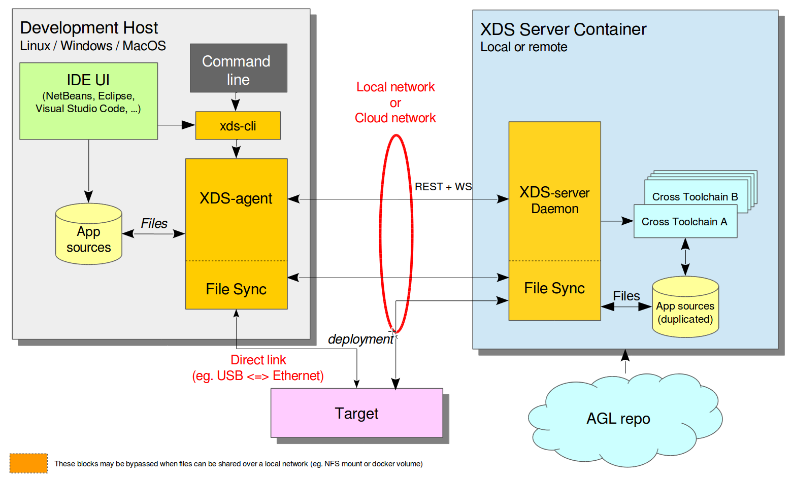

# Part 1 - Getting Started for Users

## Abstract

X(cross) Development System (XDS) is set of tools that provide a multi-platform
for cross development with near-zero installation.

XDS allows you to keep developed application sources locally (on user's machine)
to make it compatible with existing IT policies (e.g. corporate backup or SCM),
and let user to continue to work as usual (use its favorite editor,
keep performance while editing/browsing sources).

The two main blocks that compose XDS are the client part (`xds-agent`) running
on the user's machine and the server part (`xds-server`) running somewhere in a container or on a server machine (on local network or cloud).

{style width:98%;}

<!-- pagebreak -->

The client part (`xds-agent`) is portable and is running on Linux, Windows or
MacOS machine and the following 3 main configurations are supported:

- standalone (or local) config
- On-Premise (local network)
- SaaS (Cloud based)

{style width:98%;}
