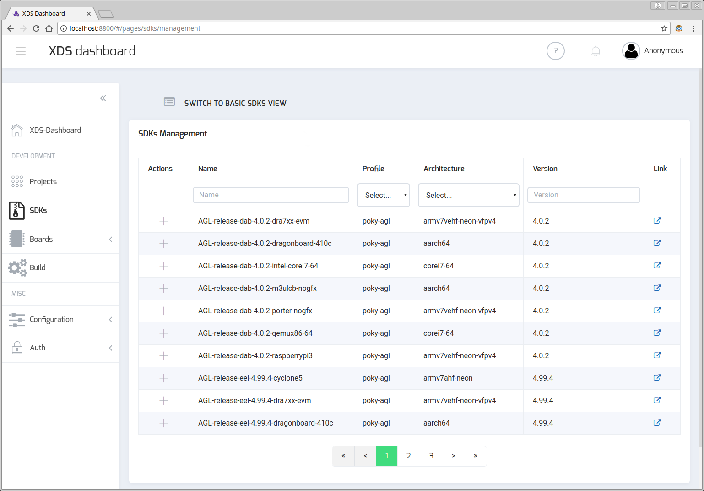
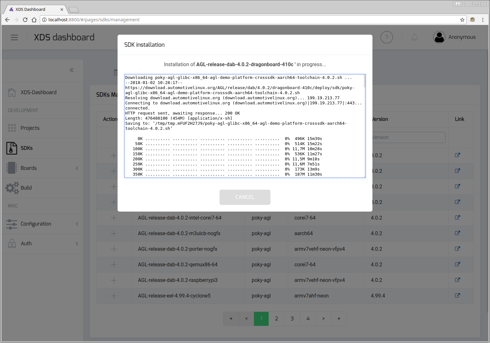

# Installing AGL SDKs

To build your AGL services or AGL applications using XDS you must install a SDK
matching the target/board you want to use. A SDK is a package that includes all
tools you need to cross-build and cross-debug your service/application.

You can generate AGL SDK for the board you want to use or you can download
a pre-packaged AGL SDK.

## Install a new SDK from command line

Used `sdks` command of `xds-cli` tool to managed SDKs.

```bash
# List all available SDKs
xds-cli sdks ls -a

List of available SDKs:
ID            NAME                                            STATUS          VERSION         ARCH
ec15afe0      AGL-release-eel-4.99.4-raspberrypi3             Not Installed   4.99.4          armv7vehf-neon-vfpv4
944d2d5a      AGL-snapshots-master-latest-intel-corei7-64     Not Installed   4.99.3+snapshot corei7-64
cf3a4365      AGL-release-dab-4.0.2-qemux86-64                Not Installed   4.0.2           corei7-64
d65fe750      AGL-release-eel-latest-qemux86-64               Not Installed   4.99.3          corei7-64
a0ae663d      poky-agl-corei7-64-3.99.1+snapshot              Installed       3.99.1+snapshot corei7-64
87f0400b      AGL-release-dab-3.99.3-m3ulcb-nogfx             Installed       3.99.3          aarch64
8c2f2841      AGL-release-dab-4.0.2-dragonboard-410c          Not Installed   4.0.2           aarch64
...

# Install a SDK (downloaded + install)
xds-cli sdks install d65fe750

Installation of 'AGL-release-eel-latest-qemux86-64' SDK successfully started.
Downloading poky-agl-glibc-x86_64-agl-demo-platform-crosssdk-corei7-64-toolchain-4.99.5.sh ...
--2018-01-02 11:22:23--  https://download.automotivelinux.org/AGL/release/eel/latest/qemux86-64/deploy/sdk/poky-agl-glibc-x86_64-agl-demo-platform-crosssdk-corei7-64-toolchain-4.99.5.sh
Resolving download.automotivelinux.org (download.automotivelinux.org)... 199.19.213.77
Connecting to download.automotivelinux.org (download.automotivelinux.org)|199.19.213.77|:443... connected.
HTTP request sent, awaiting response... 200 OK
Length: 665996704 (635M) [application/x-sh]
Saving to: ‘/tmp/tmp.wuQzLdImCS/poky-agl-glibc-x86_64-agl-demo-platform-crosssdk-corei7-64-toolchain-4.99.5.sh’

     0K .......... .......... .......... .......... ..........  0% 82,7K 2h11m
    50K .......... .......... .......... .......... ..........  0% 89,1K 2h6m
   100K .......... .......... .......... .......... ..........  0% 82,0K 2h8m
...
 50300K .......... .......... .......... .......... .......... 99% 2,15M 0s
 650350K .......... .......... .......... .......              100% 4,04M=10m35s

2018-01-02 12:17:06 (1024 KB/s) - ‘/tmp/tmp.CWyEj3z76Q/poky-agl-glibc-x86_64-agl-demo-platform-crosssdk-corei7-64-toolchain-4.99.5.sh’ saved [665996704/665996704]

Automotive Grade Linux SDK installer version 4.99.5
===================================================
You are about to install the SDK to "/xdt/sdk/poky-agl/4.99.5/corei7-64". Proceed[Y/n]? Y
Extracting SDK....................................................................................................................done
Setting it up...done
SDK has been successfully set up and is ready to be used.
Each time you wish to use the SDK in a new shell session, you need to source the environment setup script e.g.
 $ . /xdt/sdk/poky-agl/4.99.5/corei7-64/environment-setup-corei7-64-agl-linux

SDK ID d65fe750-d3a7-38f5-83d8-3d3806054f8d successfully installed.


# Abort an installation that is in progress
xds-cli sdks abort -id d65fe750

# Install a SDK (using a local SDK package/file)
xds-cli sdks install --file $HOME/xds-workspace/sdks/poky-agl-glibc-x86_64-agl-demo-platform-crosssdk-corei7-64-toolchain-4.99.5.sh

```

<!-- note -->
Installation based on a local SDK package is only supported when SDK file package
is located in `$HOME/xds-workspace/sdks` directory
<!-- endnote -->

## Install a new SDK from XDS Dashboard

Open XDS-Dashboard in web-browser and select `SDKs` entry in left side menu.
Then switch to `SDKs MANAGEMENT` view :

{:: style="margin:auto; display:flex"}

Use filter boxes to find the SDK you want to install and then click on plus
icon (Actions column) to start installation. SDK download and installation
process may take several minutes and output of installation script (output of
`add` script mentioned in above chapter).

{:: style="margin:auto; display:flex"}

Note that you can abort installation by clicking on `CANCEL` button.

## More info

Please refer to [xds-server](../part-2/1_xds-server.md) chapter for more details
about SDKs management.
