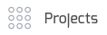
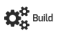
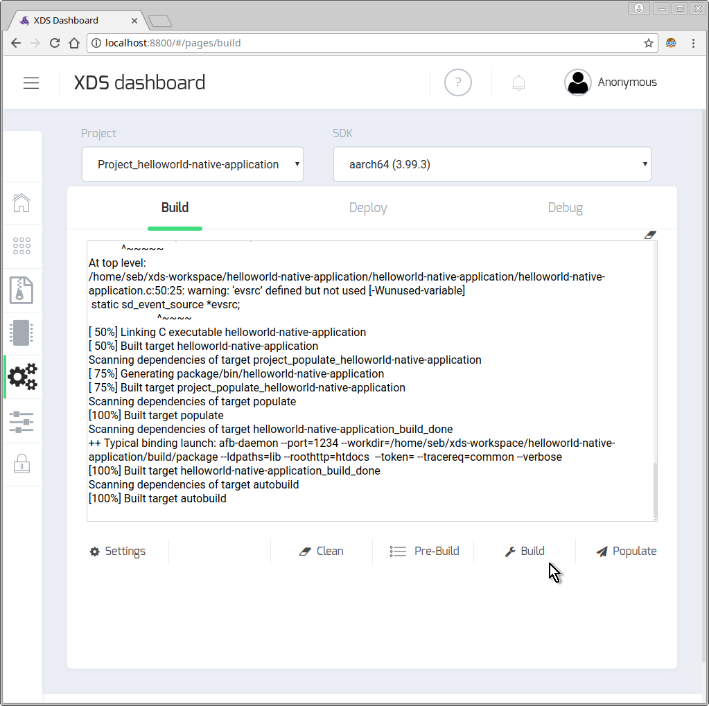

# Create your first AGL application

## Prerequisites

- `xds-agent` is running on your machine
  (see **Installing XDS client tools**  previous chapter)
- `xds-server` is running locally in a docker container or is accessible on your
  network (see **Installing XDS server** previous chapter)
- one or more SDK have been installed (see **Installing AGL SDKs** previous chapter)
- XDS configuration is correct: in other words, all table lines are blue in
  configuration page of XDS Dashboard.

## Setup

Let's use for example helloworld-native-application, so you need first to clone
this project into a directory that will be accessible by `xds-server`.
Depending of the project sharing method:

- Cloud sync: you can clone project anywhere on your local disk,
- Path mapping: you must clone project into `$HOME/xds-workspace` directory.

<!-- note -->
> **Note:** : [helloworld-native-application](https://github.com/iotbzh/helloworld-native-application) project is an AGL
project based on [app-templates](https://git.automotivelinux.org/apps/app-templates/)
(included as a git submodule). This CMake templating, used to develop application
with the AGL Application Framework, will automatically generate makefile rules
(eg. `remote-target-populate`) or scripts (eg. `build/target/xxx` scripts).

For more info about app-template, please refer to [this documentation](http://docs.automotivelinux.org/docs/devguides/en/dev/reference/sdk-devkit/docs/part-2/2_4-Use-app-templates.html).
<!-- endnote -->

### Clone project

```bash
cd $HOME/xds-workspace
git clone --recursive https://github.com/iotbzh/helloworld-native-application.git
```

### Declare project into XDS

Use XDS Dashboard to declare your project. Open a browser and connect to XDS
Dashboard. URL depends of your config, for example `http://localhost:8000`

Click cog icon {:: style="display:inline; padding:0;"}
to open configuration panel and then create/declare a new project by with the
plus icon
{:: style="display:inline; padding:0;"}
of `Projects` bar.

Set `Sharing Type` and paths according to your setup.

{:: style="width:90%;"}

Note that XDS creates a file name `xds-project.conf` (if not already exists)
when you declare a new project using XDS Dashboard. This file may be very useful
when you will use XDS client tools such as `xds-exec` (see next chapter).

<!-- note -->
>**Note:** when you select `Path mapping`, you must clone your project into
`$HOME/xds-workspace` directory (named "Local Path" in modal window) and
"Server Path" must be set to `/home/devel/xds-workspace/xxx` where xxx is your
project directory name. If you select `Cloud Sync`, you can clone your project
where you want on your local disk.
<!-- endnote -->

## Build from XDS dashboard

Open the build page (icon {:: style="display:inline; padding:0;"}), then select your **Project** and the **Cross SDK** you want to use and click on
**Clean / Pre-Build / Build / Populate** buttons to execute various build actions.

{:: style="width:90%;"}

## Build from command line

You need to determine which is the unique id of your project. You can find
this ID in project page of XDS dashboard or you can get it from command line
using the `--list` option. This option lists all existing projects ID:

```bash
xds-exec --list

List of existing projects:
  CKI7R47-UWNDQC3_myProject
  CKI7R47-UWNDQC3_test2
  CKI7R47-UWNDQC3_test3
```

> **Note:** XDS tools, including `xds-exec` are installed by default in `/opt/AGL/bin`
> directory and this path has been added into your PATH variable.
> If it is not the case, just add it manually using `export PATH=${PATH}:/opt/AGL/bin` command line.

Now to refer your project, just use --id option or use `XDS_PROJECT_ID`
environment variable.

You are now ready to use XDS to for example cross build your project.
Here is an example to build a project based on CMakefile:

```bash
# Go into your project directory and create a build directory
cd $MY_PROJECT_DIR
mkdir build

# Generate build system using cmake
xds-exec --id=CKI7R47-UWNDQC3_myProject --sdkid=poky-agl_aarch64_4.0.1 --url=http://localhost:8000 -- cd build && cmake ..

# Build the project
xds-exec --id=CKI7R47-UWNDQC3_myProject --sdkid=poky-agl_aarch64_4.0.1 --url=http://localhost:8000 -- cd build && make all
```

To avoid to set project id, xds server url, ... at each command line, you can
define these settings as environment variable within an env file and just set
`--config` option or source file before executing xds-exec.

XDS creates a file name `xds-project.conf` (only if not already exists) when you
declare a new project using XDS Dashboard. Use this file with `--config` option.

For example, the equivalence of above command is:

```bash
# MY_PROJECT_DIR=/home/seb/xds-workspace/helloworld-native-application
cd $MY_PROJECT_DIR

# Edit and potentially adapt xds-project.conf file that has been created
# automatically on project declaration using XDS Dashboard
vi xds-project.conf
  # XDS project settings
  export XDS_SERVER_URL=localhost:8000
  export XDS_PROJECT_ID=cde3b382-9d3b-11e7_helloworld-native-application
  export XDS_SDK_ID=poky-agl_aarch64_4.0.1

# Create build directory and invoke cmake and then build project
xds-exec --config xds-project.conf -- "mkdir -p build && cd build && cmake .."
cd build && xds-exec -- make all

# Or equivalent by first sourcing conf file (avoid to set --config option)
source xds-project.conf
xds-exec -- "mkdir -p build && cd build && cmake .."
cd build && xds-exec -- make all
```

<!-- note -->
>**Note:** all parameters after a double dash (--) are considered as the command
to execute on xds-server.
<!-- endnote -->

## Build from IDE

First create an XDS config file or reuse the previous one, for example we use 
here aarch64 SDK to cross build application for a Renesas Gen3 board.

```bash
# create file at root directory of your project
# for example:
# MY_PROJECT_DIR=/home/seb/xds-workspace/helloworld-native-application
cat > $MY_PROJECT_DIR/xds-project.conf << EOF
 export XDS_SERVER_URL=localhost:8000
 export XDS_PROJECT_ID=cde3b382-9d3b-11e7_helloworld-native-application
 export XDS_SDK_ID=poky-agl_aarch64_3.99.3
EOF
```

### NetBeans

This chapter will show you how to create 2 configurations, one to compile your
project natively (using native GNU gcc) and one to cross-compile your project
using XDS. You can easily switch from one to other configuration using menu
**Run -> Set Project Configuration**.

__Netbeans 8.x :__

- Open menu **Tools** -> **Options**
  - Open **C/C++** tab, in **Build Tools** sub-tab, click on **Add** button:

    

  - Then, you should set **Make Command** and **Debugger Command** to point to xds tools:

    

  - Finally click on **OK** button.

- Now create we first declare project into NetBeans and create first a native
  configuration. To do that, open menu **File** -> **New Project**

- Select **C/C++ Project with Existing Sources** ;
  Click on **Next** button

- Specify the directory where you cloned your project and click on **Finish** button to keep all default settings in order to create a *native configuration*.

    

<!-- warning -->
> **Warning:** Take care to set **Tool Collection** to **Default GNU** in order
> to create a native configuration based on native GNU GCC.
<!-- endwarning -->

- Now we will create a **cross configuration** based on XDS tools.
  Edit project properties (using menu **File** -> **Project Properties**) to add a new configuration that will use XDS to cross-compile your application for example for a Renesas Gen3 board.

  - in **Build** category, click on **Manage Configurations** button and then **New** button to add a new configuration named for example "Gen3 board"

    

  - Click on **Set Active** button

  - Select **Pre-Build** sub-category, and set:
    - Working Directory: `build_gen3`
    - Command Line: `xds-exec -c ../xds-project.conf -- cmake -DRSYNC_TARGET=root@renesas-gen3 -DRSYNC_PREFIX=/opt ..`
    - Pre-build First: `ticked`

  - Select **Make** sub-category, and set:
    - Working Directory: `build_gen3`
    - Build Command: `xds-exec -c ../xds-project.conf -- make remote-target-populate`
    - Clean Command: `xds-exec -c ../xds-project.conf -- make clean`

    

  - Select **Run** sub-category, and set:
    - Run Command: `target/start-on-root@renesas-gen3.sh`
    - Run Directory: `build-gen3`

    

  - Click on **OK** button to save settings

By changing configuration from **Default** to **Gen3 board**, you can now simply
compile your helloworld application natively (**Default** configuration) or
cross-compile your application through XDS for the Renesas Gen3 board
(**Gen3 board** configuration).

### Visual Studio Code

Open your project in VS Code

```bash
cd $MY_PROJECT_DIR
code . &
```

Add new tasks : press `Ctrl+Shift+P` and select the `Tasks: Configure Task`
command and you will see a list of task runner templates.

And define your own tasks, here is an example to build
[helloworld-native-application](https://github.com/iotbzh/helloworld-native-application)
AGL helloworld application based on cmake template.

```json
{
    "version": "2.0.0",
    "type": "shell",
    "presentation": {
        "reveal": "always"
    },
    "tasks": [
        {
            "taskName": "clean",
            "command": "/bin/rm -rf ${workspaceFolder}/build/* && mkdir -p build && echo Cleanup done.",
            "problemMatcher": []
        },
        {
            "taskName": "pre-build",
            "group": "build",
            "command": "/opt/AGL/bin/xds-exec --rpath build --config xds-project.conf -- cmake -DRSYNC_TARGET=root@renesas-gen3 -DRSYNC_PREFIX=/opt ../",
            "problemMatcher": [
                "$gcc"
            ]
        },
        {
            "taskName": "build",
            "group": "build",
            "command": "/opt/AGL/bin/xds-exec --rpath build --config xds-project.conf -- make widget",
            "problemMatcher": [
                "$gcc"
            ]
        },
        {
            "taskName": "populate",
            "command": "/opt/AGL/bin/xds-exec --rpath build --config xds-project.conf -- make widget-target-install",
            "problemMatcher": []
        }
    ]
}
```

> **Note:** You can also add your own keybindings to trig above tasks, for example:
>
> ```json
> // Build
> {
>   "key": "alt+f9",
>   "command": "workbench.action.tasks.runTask",
>   "args": "clean"
> },
> {
>   "key": "alt+f10",
>   "command": "workbench.action.tasks.runTask",
>   "args": "pre-build"
> },
> {
>   "key": "alt+f11",
>   "command": "workbench.action.tasks.runTask",
>   "args": "build"
> },
> {
>   "key": "alt+f12",
>   "command": "workbench.action.tasks.runTask",
>   "args": "populate"
> },
> ```
>
> More details about VSC keybindings [here](https://code.visualstudio.com/docs/editor/tasks#_binding-keyboard-shortcuts-to-tasks)
>
> More details about VSC tasks [here](https://code.visualstudio.com/docs/editor/tasks)

#### Qt Creator

Please refer to [agl-hello-qml](https://github.com/radiosound-com/agl-hello-qml#clone--build-project) project.
Thanks to Dennis for providing this useful example.

#### Others IDE

*Coming soon...*
