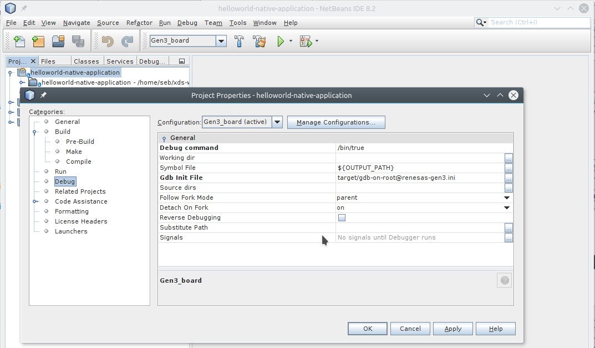

# Debug your first AGL application

Debug is based on gdb and you need to use `xds-gdb` as a wrapper on gdb to
cross-debug your application. This tool allows you to debug an application built
with XDS without the need to install gdb or any cross tools.

Two debugging models are supported:

1. native debugging

1. XDS remote debugging requiring an XDS agent/server setup and that allows you to cross debug your application.

By default XDS debug model is used and you need to define `XDS_NATIVE_GDB`
variable to use native gdb debug mode instead.

## Configuration

 `xds-gdb` configuration is defined by variables (see listed below).
 These variables may be set using :

- environment variables (inherited),
- or a config file set with `XDS_CONFIG` environment variable, for example:
  `XDS_CONFIG=/tmp/my_xds_gdb_config.env xds-gdb`
- or by setting variables within a gdb ini file (see details below),
- or a "user" config file located in following directory (first found is taken):
  1. $(CURRENT_DIRECTORY)/.xds-gdb.env
  1. $(CURRENT_DIRECTORY)/../xds-gdb.env
  1. $(CURRENT_DIRECTORY)/target/xds-gdb.env
  1. $(HOME)/.config/xds/xds-gdb.env

### Configuration Variables

 `XDS_CONFIG`
 Config file defining `XDS_xxx` configuration variables. Variables of this file
 will overwrite inherited environment variables. Variables definition may be
 prefixed or not by "export" keyword.
 Here is an example of configuration file

```bash
# for example:
# MY_PROJECT_DIR=/home/seb/xds-workspace/helloworld-native-application
cat > $MY_PROJECT_DIR/xds-gen3.conf << EOF
export XDS_AGENT_URL=localhost:8800
export XDS_PROJECT_ID=4021617e-ced0-11e7-acd2-3c970e49ad9b
export XDS_SDK_ID=c226821b-b5c0-386d-94fe-19f807946d03
EOF
```

`XDS_LOGLEVEL`

Set logging level (supported levels: panic, fatal, error, warn, info, debug)

`XDS_LOGFILE`

Set logging file, default `/tmp/xds-gdb.log`.

`XDS_NATIVE_GDB`

Use native gdb mode instead of remote XDS mode.

`XDS_PROJECT_ID`  *(mandatory in XDS mode)*

Project ID you want to build

`XDS_RPATH`

Relative path into project

`XDS_SDK_ID`   *(mandatory in XDS mode)*

Cross Sdk ID to use to build project

`XDS_AGENT_URL`

Local XDS agent url (default `http://localhost:8800`)

### Configuration variables set within gdb init command file

Above `XDS_xxx` variables may also be defined within gdb init command file
(see --command or -x option of genuine Gdb).
You must respect the following syntax: commented line including `:XDS-ENV:` tag

Example of gdb init file where we define project and sdk ID:

```bash
     # :XDS-ENV: XDS_PROJECT_ID=4021617e-ced0-11e7-acd2-3c970e49ad9b
     # :XDS-ENV: XDS_SDK_ID=c226821b-b5c0-386d-94fe-19f807946d03
```

## Using xds-gdb from command line

### XDS remote debugging mode

First the project you want to debug must be declared on an xds-server and this
project may also has been built using using XDS (see [Create your first AGL application](./4_build-first-app.md) for more details).

So to debug it you need to have the XDS agent - server chain in place and
you also need the project and sdk unique id. You can find these IDs in project
page of XDS dashboard or you can get them from command line using the `--list`
option.
This option lists all existing projects ID:

```bash
xds-gdb --list
```

Now to refer your project, just set `XDS_PROJECT_ID` and `XDS_SDK_ID` variables.

You are now ready to use `xds-gdb` to for example cross debug your project.
Here is an example to build and debug a project based on CMakefile and
[AGL app-templates](https://git.automotivelinux.org/apps/app-templates/):

```bash
# Go into your project directory (for example helloworld-native-application)
cd ~/xds-workspace
git clone https://github.com/iotbzh/helloworld-native-application.git
cd helloworld-service

# Declare your project on xds-server
# <for now, you can only do this step using xds HTML dashboard (see xds-server doc)>

# Define XDS config
cat <<EOF >./xds-config.env
#optional if not default value: XDS_AGENT_URL=http://localhost:8800
XDS_PROJECT_ID=IW7B4EE-DBY4Z74_myProject
XDS_SDK_ID=poky-agl_aarch64_4.0.1
EOF

# Tell to xds-cli and xds-gdb which is your config file
export XDS_CONFIG=../xds-gen3.conf

# Create a new build directory
mkdir build && cd build

# Start remote cross build
xds-cli exec -- cmake -DRSYNC_TARGET=root@myTarget ..
xds-cli exec -- make
xds-cli exec -- make remote-target-populate

# Start debugging
xds-gdb -x target/gdb-on-root@myTarget.ini
```

<!-- note -->
**Note:** : [helloworld-native-application](https://github.com/iotbzh/helloworld-native-application) project is an AGL
project based on [app-templates](https://git.automotivelinux.org/apps/app-templates/)
(included as a git submodule). This CMake templating, used to develop application
with the AGL Application Framework, will automatically generate makefile rules
(eg. `remote-target-populate`) or scripts (eg. `build/target/xxx` scripts).

For more info about app-template, please refer to [this documentation](http://docs.automotivelinux.org/docs/devguides/en/dev/reference/sdk-devkit/docs/part-2/2_4-Use-app-templates.html).
<!-- endnote -->

### Native debugging

To enable native debugging mode, you need to define `XDS_NATIVE_GDB` variable.

## Using xds-gdb within an IDE

### Netbeans

__Netbeans 8.x :__

- Open menu **Tools** -> **Options**
  - Open **C/C++** tab, in **Build Tools** sub-tab, click on **Add** button:

    {:: style="width:90%; max-width:700px; margin:auto; display:flex"}

  - Then, you should set **Make Command** and **Debugger Command** to point to xds tools:

    {:: style="width:90%; max-width:700px; margin:auto; display:flex"}

  - Finally click on **OK** button.

- Edit project properties (using menu **File** -> **Project Properties**) to update Debug settings:

  - Be sure that "Gen3 board" configuration is selected

  - Select **Run** category, and set:
    - Run Command: `target/start-on-root@renesas-gen3.sh`
      (_script name may depend of RSYNC_TARGET variable you set in pre-build command_)
    - Run Directory: `build_gen3`

  - Select **Debug** category, and set:
    - Debug command: `/bin/true`
    - Working Directory: _empty field_
    - Gdb Init File: `target/gdb-on-root@renesas-gen3.ini`
      (_script name may depend of RSYNC_TARGET variable you set in pre-build command_)

    {:: style="width:90%; max-width:700px; margin:auto; display:flex"}

  - Click on **Apply** and then **OK** button to save settings

You can now start debugging your application with menu **Debug** -> **Debug Project** (or **CTRL+F5** shortcut)

### Others IDE

*Coming soon...*
