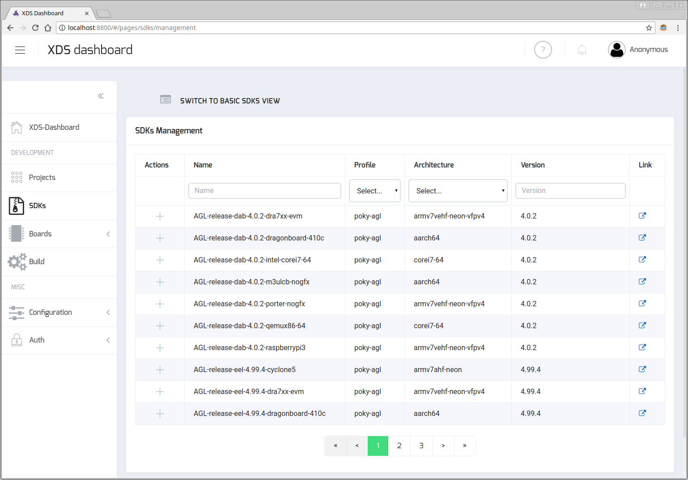
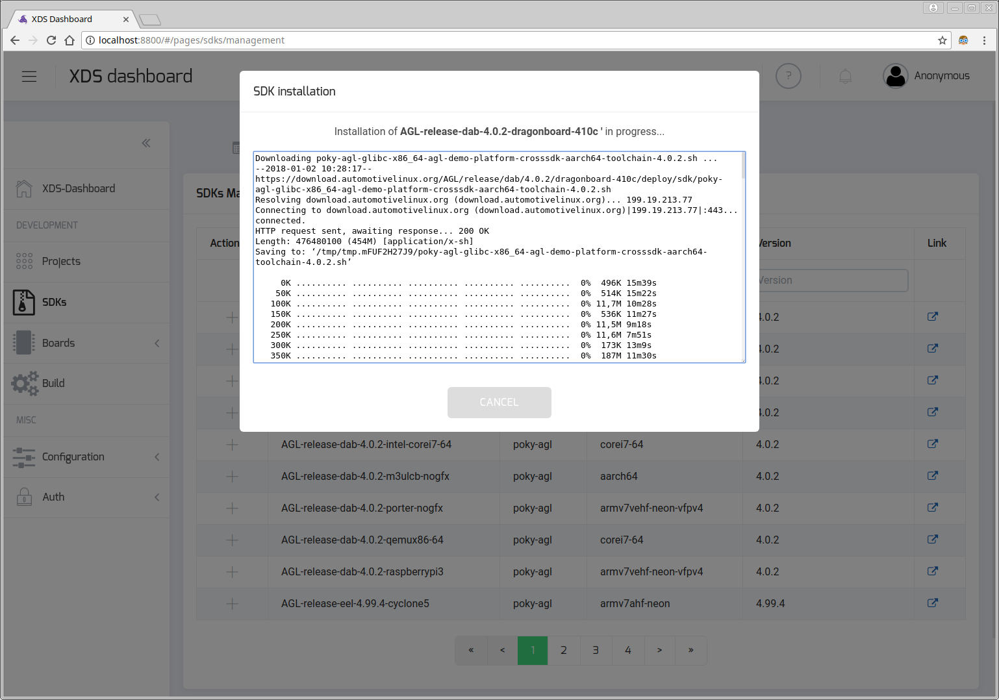

# XDS - X(cross) Development System Server

`xds-server` is a web server that allows user to remotely cross build applications.

The first goal is to provide a multi-platform cross development tool with
near-zero installation.
The second goal is to keep application sources locally (on user's machine) to
make it compatible with existing IT policies (e.g. corporate backup or SCM),
and let user to continue to work as usual (use his favorite editor,
keep performance while editing/browsing sources).

This powerful and portable webserver (written in [Go](https://golang.org))
exposes a REST interface over HTTP.

`xds-server` uses [Syncthing](https://syncthing.net/) tool to synchronize
projects files from user machine to build server machine or container.

`xds-server` is commonly running on a build server (within a container or not)
and [xds-agent](2_xds-agent.md) must run on the developer/user machine in order
to setup the following connection chain:

```schema
    developer/user machine  |  build server or container
 ---------------------------|-----------------------------
  xds-cli <---> xds-agent <-|-> xds-server
```

**SEE ALSO**: [xds-cli](https://github.com/iotbzh/xds-cli),
a command-line tool that allows you to send commands to `xds-agent / xds-server`
and for example build your application from command-line or from your favorite
IDE (such as Netbeans or Visual Studio Code) through `xds-agent <=> xds-server`.

## How to run

`xds-server` has been designed to easily compile and debug
[AGL](https://www.automotivelinux.org/) applications. That's why `xds-server` has
been integrated into AGL SDK docker container.

>**Note:** For more info about AGL SDK docker container, please refer to
[AGL SDK Quick Setup](http://docs.automotivelinux.org/docs/getting_started/en/dev/reference/setup-sdk-environment.html)

### Get the container

Load the pre-build AGL SDK docker image including `xds-server`:

```bash
wget -O - http://iot.bzh/download/public/XDS/docker/docker_agl_worker-xds-latest.tar.xz | docker load
```

### List container

You should get `docker.automotivelinux.org/agl/worker-xds:X.Y` image

```bash
# List image that we just built
docker images | grep worker-xds

docker.automotivelinux.org/agl/worker-xds       3.99.1              786d65b2792c        6 days ago          602MB
```

### Start xds-server within the container

Use provided script to create a new docker image and start a new container:

```bash
# Get script
wget https://raw.githubusercontent.com/iotbzh/xds-server/master/scripts/xds-docker-create-container.sh

# Create new XDS worker container
bash ./xds-docker-create-container.sh

# Check that new container is running
docker ps | grep worker-xds

b985d81af40c        docker.automotivelinux.org/agl/worker-xds:3.99.1       "/usr/bin/wait_for..."   6 days ago           Up 4 hours          0.0.0.0:8000->8000/tcp, 0.0.0.0:69->69/udp, 0.0.0.0:10809->10809/tcp, 0.0.0.0:2222->22/tcp    agl-xds-seb@laptop-0-seb
```

Note that you can also add a new shared directory using `--volume` option in order
to use for example with Path-Mapping folder type.

```bash
# Create new XDS worker container and share extra '$HOME/my-workspace' directory
bash ./xds-docker-create-container.sh --volume /my-workspace:$HOME/my-workspace
```

This container (ID=0) exposes following ports:

- 8000 : `xds-server` to serve XDS webapp
- 69   : TFTP
- 2222 : ssh

#### Manually setup docker user id

<!-- note -->
**Note:** if you used `xds-docker-create-container.sh` script to create XDS
docker container, user uid/gid inside docker has already been changed by this script.
<!-- endnote -->

If you plan to **use path-mapping sharing type for your projects**, you need to
have the same user id and group id inside and outside docker. By default user
and group name inside docker is set `devel` (id `1664`), use following commands
to replace id `1664` with your user/group id:

```bash
# Set docker container name to use (usually agl-xds-xxx where xxx is USERNAME@MACHINENAME-IDX-NAME)
export CONTAINER_NAME=agl-xds-seb@laptop-0-seb

# First kill all processes of devel user (including running xds-server)
docker exec ${CONTAINER_NAME} bash -c "/bin/loginctl kill-user devel"

# Change user and group id inside docker to match your ids
docker exec ${CONTAINER_NAME} bash -c "usermod -u $(id -u) devel"
docker exec ${CONTAINER_NAME} bash -c "groupmod -g $(id -g) devel"

# Update some files ownership
docker exec ${CONTAINER_NAME} bash -c "chown -R devel:devel /home/devel /tmp/xds*"

# Restart devel autologin service
docker exec ${CONTAINER_NAME} bash -c "systemctl start autologin"

# Restart xds-server as a service (ssh port 2222 may depend on your container ID)
ssh -p 2222 devel@localhost -- "systemctl --user start xds-server"
```

## Check if xds-server is running (open XDS webapp)

**`xds-server` is automatically started** as a service on container startup.

If the container is running on your localhost, you can access to a basic web
application:

```bash
xdg-open http://localhost:8000
```

If needed you can status / stop / start  it manually using following commands:

```bash
# Log into docker container
ssh -p 2222 devel@localhost

# Status XDS server:
devel@docker ~$ systemctl --user status xds-server.service

# Stop XDS server
devel@docker ~$ systemctl --user stop xds-server.service

# Start XDS server
devel@docker ~$ systemctl --user start xds-server.service

# Get XDS server logs
devel@docker ~$ journalctl --user --unit=xds-server.service --output=cat
```

### Manually Start XDS server

XDS server is started as a service by Systemd.

```bash
/lib/systemd/system/xds-server.service
```

This Systemd service starts a bash script `/opt/AGL/xds/server/xds-server-start.sh`

If you needed you can change default setting by defining specific environment
variables in `/etc/default/xds-server`.
For example to control log level, just set LOG_LEVEL env variable knowing that
supported *level* are: panic, fatal, error, warn, info, debug.

```bash
ssh -p 2222 devel@localhost
devel@docker ~$ echo 'LOG_LEVEL=debug' | sudo tee --append /etc/default/xds-server > /dev/null
devel@docker ~$ systemctl --user restart xds-server.service
devel@docker ~$ tail -f /tmp/xds-server/logs/xds-server.log
```

### SDK cross-toolchain Management

#### Setup to add support of a new SDK family

<!-- note -->
**Optional step**: read this chapter only if you plan to add a new SDK family.
<!-- endnote -->

`xds-server` dynamically detects supported SDKs by scanning sub-directories of
`sdkScriptsDir` directory (see [Configuration chapter](#configuration)).
Each sub-directory (usually name is the same as the SDK family) of `sdkScriptsDir`
must contain a set of scripts that will be called by `xds-server` to managed SDKs
of a specific family.

These scripts are:

- `add`: used to add/install a new SDK
- `db-dump`: returned the list of available and installed SDKs (JSON format)
- `db-update`: update SDKs database
- `get-family-config`: returned SDK family configuration structure (JSON format)
- `get-sdk-info`: extract SDK info (JSON format) from a SDK file/tarball
- `remove`: used to remove an existing SDK

For example, here 2 SDKs family (`agl` and `zephyr`) are defined :

```bash
# > tree ./sdks/
./sdks/
├── agl
│   ├── add
│   ├── db-dump
│   ├── db-update
│   ├── get-family-config
│   ├── get-sdk-info
│   └── remove
├── README.md
└── zephyr
    ├── add
│   ├── db-dump
│   ├── db-update
│   ├── get-family-config
│   ├── get-sdk-info
    └── remove
```

On startup `xds-server` will call first `sdks/*/get-family-config` to get configuration
of each SDK family and also call `sdks/*/db-dump` scripts to get the initial list
of available and installed SDKs.

Please refer to `sdks/README.md` for more information about scripts definition
and to understand how to add support of a new SDK family.

#### Install a new SDK from command line

Used `sdks` command of `xds-cli` tool to managed SDKs.

```bash
# List all available SDKs
xds-cli sdks ls -a

List of available SDKs:
ID            NAME                                            STATUS          VERSION         ARCH
ec15afe0      AGL-release-eel-4.99.4-raspberrypi3             Not Installed   4.99.4          armv7vehf-neon-vfpv4
944d2d5a      AGL-snapshots-master-latest-intel-corei7-64     Not Installed   4.99.3+snapshot corei7-64
cf3a4365      AGL-release-dab-4.0.2-qemux86-64                Not Installed   4.0.2           corei7-64
d65fe750      AGL-release-eel-latest-qemux86-64               Not Installed   4.99.3          corei7-64
a0ae663d      poky-agl-corei7-64-3.99.1+snapshot              Installed       3.99.1+snapshot corei7-64
87f0400b      AGL-release-dab-3.99.3-m3ulcb-nogfx             Installed       3.99.3          aarch64
8c2f2841      AGL-release-dab-4.0.2-dragonboard-410c          Not Installed   4.0.2           aarch64
...

# Install a SDK (downloaded + install)
xds-cli sdks install d65fe750

Installation of 'AGL-release-eel-latest-qemux86-64' SDK successfully started.
Downloading poky-agl-glibc-x86_64-agl-demo-platform-crosssdk-corei7-64-toolchain-4.99.5.sh ...
--2018-01-02 11:22:23--  https://download.automotivelinux.org/AGL/release/eel/latest/qemux86-64/deploy/sdk/poky-agl-glibc-x86_64-agl-demo-platform-crosssdk-corei7-64-toolchain-4.99.5.sh
Resolving download.automotivelinux.org (download.automotivelinux.org)... 199.19.213.77
Connecting to download.automotivelinux.org (download.automotivelinux.org)|199.19.213.77|:443... connected.
HTTP request sent, awaiting response... 200 OK
Length: 665996704 (635M) [application/x-sh]
Saving to: ‘/tmp/tmp.wuQzLdImCS/poky-agl-glibc-x86_64-agl-demo-platform-crosssdk-corei7-64-toolchain-4.99.5.sh’

     0K .......... .......... .......... .......... ..........  0% 82,7K 2h11m
    50K .......... .......... .......... .......... ..........  0% 89,1K 2h6m
   100K .......... .......... .......... .......... ..........  0% 82,0K 2h8m
...
 50300K .......... .......... .......... .......... .......... 99% 2,15M 0s
 650350K .......... .......... .......... .......              100% 4,04M=10m35s

2018-01-02 12:17:06 (1024 KB/s) - ‘/tmp/tmp.CWyEj3z76Q/poky-agl-glibc-x86_64-agl-demo-platform-crosssdk-corei7-64-toolchain-4.99.5.sh’ saved [665996704/665996704]

Automotive Grade Linux SDK installer version 4.99.5
===================================================
You are about to install the SDK to "/xdt/sdk/poky-agl/4.99.5/corei7-64". Proceed[Y/n]? Y
Extracting SDK....................................................................................................................done
Setting it up...done
SDK has been successfully set up and is ready to be used.
Each time you wish to use the SDK in a new shell session, you need to source the environment setup script e.g.
 $ . /xdt/sdk/poky-agl/4.99.5/corei7-64/environment-setup-corei7-64-agl-linux

SDK ID d65fe750-d3a7-38f5-83d8-3d3806054f8d successfully installed.


# Abort an installation that is in progress
xds-cli sdks abort -id d65fe750

# Install a SDK (using a local SDK package/file)
xds-cli sdks install --file $HOME/xds-workspace/sdks/poky-agl-glibc-x86_64-agl-demo-platform-crosssdk-corei7-64-toolchain-4.99.5.sh

```

<!-- note -->
Installation based on a local SDK package is only supported when SDK file package
is located in `$HOME/xds-workspace/sdks` directory
<!-- endnote -->

#### Install a new SDK from XDS Dashboard

Open XDS-Dashboard in web-browser and select `SDKs` entry in left side menu.
Then switch to `SDKs MANAGEMENT` view :

{:: style="margin:auto; display:flex"}

Use filter boxes to find the SDK you want to install and then click on plus
icon (Actions column) to start installation. SDK download and installation
process may take several minutes and output of installation script (output of
`add` script mentioned in above chapter).

{:: style="margin:auto; display:flex"}

Note that you can abort installation by clicking on `CANCEL` button.

#### Un-install a SDK from command line

Used `sdks` command of `xds-cli` tool to managed SDKs.

```bash
# List installed SDKs
xds-cli sdks ls
List of installed SDKs:
  ID            NAME                                                            STATUS          VERSION         ARCH
  c39e5998      poky-agl_aarch64_4.0.1                                          Installed       4.0.1           aarch64
  d610bfbf      poky-agl-aarch64.current_on_iotbzh_download-3.99.1+snapshot     Installed       3.99.1+snapshot aarch64.current_on_iotbzh_download
  a0ae663d      poky-agl-corei7-64-3.99.1+snapshot                              Installed       3.99.1+snapshot corei7-64
  87f0400b      AGL-release-dab-3.99.3-m3ulcb-nogfx                             Installed       3.99.3          aarch64
  352c0584      poky-agl-corei7-64-3.99.2+snapshot                              Installed       3.99.2+snapshot corei7-64
  d65fe750      AGL-release-eel-latest-qemux86-64                               Installed       4.99.5          corei7-64
  74f78335      poky-agl-aarch64.libmicrohttp_0.9.55-3.99.1+snapshot            Installed       3.99.1+snapshot aarch64.libmicrohttp_0.9.55

# Un-install a SDK
xds-cli sdks uninstall d65fe750
SDK ID d65fe750-d3a7-38f5-83d8-3d3806054f8d successfully deleted.
```

#### Un-install a SDK from XDS Dashboard

Open XDS-Dashboard in web-browser and select `SDKs` entry in left side menu.
If needed, switch to `BASIC SDKS VIEW` view and click on trash icon located
in the top-right corner of SDK card.

### XDS server REST API and Web application

`xds-server` exposes a REST API and serves a basic web-application.

REST API based url is `http://localhost:8000/api/v1/` when XDS server is
running on your host (localhost) and basic web-application is available at
[http://localhost:8000](http://localhost:8000).

Just replace `localhost` by the host name or ip when `xds-server` is running
on another host.

```bash
# Get version using REST API
curl http://localhost:8000/api/v1/version

# Open browser and local xds-server web-application
xdg-open http://localhost:8000
```

Then follow instructions provided on this page to install and start `xds-agent`
that must run locally on your machine.

See also [xds-agent documentation](2_xds-agent.md) for more details.

## Build xds-server from scratch

### Dependencies

- Install and setup [Go](https://golang.org/doc/install) version 1.8.1 or higher to compile this tool.
- Install [npm](https://www.npmjs.com/)
- Install [nodejs](https://nodejs.org/en/)

Ubuntu:

```bash
 sudo apt-get install golang npm curl git zip unzip
 sudo npm install --global @angular/cli   # Angular Command Line Interface
 # Install LTS version of nodejs
 sudo n lts
```

openSUSE:

```bash
 sudo zypper install go npm git curl zip unzip
 sudo npm install --global @angular/cli   # Angular Command Line Interface
 # Install LTS version of nodejs
 sudo n lts
```

Don't forget to open new user session after installing the packages.

### Building

#### Native build

Create a GOPATH variable(must be a full path):

```bash
 export GOPATH=$(realpath ~/workspace_go)
```

Clone this repo into your `$GOPATH/src/github.com/iotbzh` and use delivered Makefile:

```bash
 mkdir -p $GOPATH/src/github.com/iotbzh
 cd $GOPATH/src/github.com/iotbzh
 git clone https://github.com/iotbzh/xds-server.git
 cd xds-server
 make all
```

And to install `xds-server` (by default in `/opt/AGL/xds/server`):

```bash
 make install
```

<!-- warning -->
**Warning:** makefile install rule and default values in configuration file are set
to fit the docker setup, so you may need to adapt some settings when you want to install
xds-server natively.
<!-- endwarning -->

<!-- note -->
**Note:** Used `DESTDIR` to specify another install directory

```bash
make install DESTDIR=$HOME/opt/xds-server
```

<!-- endnote -->

#### XDS docker image

As an alternative to a pre-build image, you can rebuild the container from scratch.
`xds-server` has been integrated as a flavour of AGL SDK docker image.
So to rebuild docker image just execute following commands:

```bash
# Clone docker-worker-generator git repo
git clone https://git.automotivelinux.org/AGL/docker-worker-generator
# Start build that will create a docker image
cd docker-worker-generator
make build FLAVOUR=xds
```

### Configuration

`xds-server` configuration is driven by a JSON config file (`server-config.json`).

Here is the logic to determine which `server-config.json` file will be used:

1. from command line option: `--config myConfig.json`
1. `$HOME/.xds/server/server-config.json` file
1. `/etc/xds/server/server-config.json` file
1. `<xds-server executable dir>/server-config.json` file

Supported fields in configuration file are (all fields are optional and example
below corresponds to the default values):

- **httpPort** : HTTP port of client webapp/REST API
- **webAppDir** : location of client web application (default: webapp/dist)
- **shareRootDir** : root directory where projects will be copied
- **logsDir**  : directory to store logs (eg. syncthing output)
- **sdkScriptsDir** : directory where scripts, used to managed SDKs, are installed
- **syncthing.binDir** : syncthing binaries directory (default: executable directory)
- **syncthing.home"** : syncthing home directory (usually .../syncthing-config)
- **syncthing.gui-address** : syncthing gui url (default <http://localhost:8385>)
- **syncthing.gui-apikey** : syncthing api-key to use (default auto-generated)

```json
{
    "httpPort": 8000,
    "webAppDir": "webapp/dist",
    "shareRootDir": "${HOME}/.xds/server/projects",
    "logsDir": "/tmp/logs",
    "sdkScriptsDir": "${EXEPATH}/scripts/sdks",
    "syncthing": {
        "binDir": "./bin",
        "home": "${HOME}/.xds/server/syncthing-config",
        "gui-address": "http://localhost:8385",
        "gui-apikey": "123456789",
    }
}
```

>**Note:** environment variables are supported by using `${MY_VAR}` syntax.

## Debugging

### XDS server architecture

The server part is written in *Go* and web app (basic HTML) in *Angular4*.

```bash
|
+-- bin/                where xds-server binary file will be built
|
+-- conf.d              Linux configuration and startup files (systemd user service)
|
+-- glide.yaml          Go package dependency file
|
+-- lib/                sources of server part (Go)
|
+-- main.go             main entry point of of Web server (Go)
|
+-- Makefile            makefile including
|
+-- README.md           this readme
|
+-- scripts/            hold various scripts used for installation or startup
|
+-- tools/              temporary directory to hold development tools (like glide)
|
+-- vendor/             temporary directory to hold Go dependencies packages
|
+-- webapp/             source client basic web application
```

Visual Studio Code launcher settings can be found into `.vscode/launch.json`.
